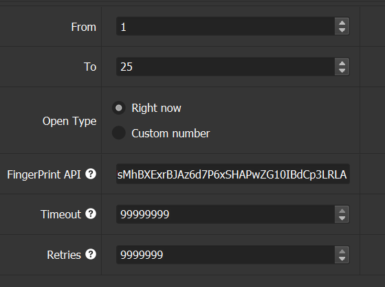
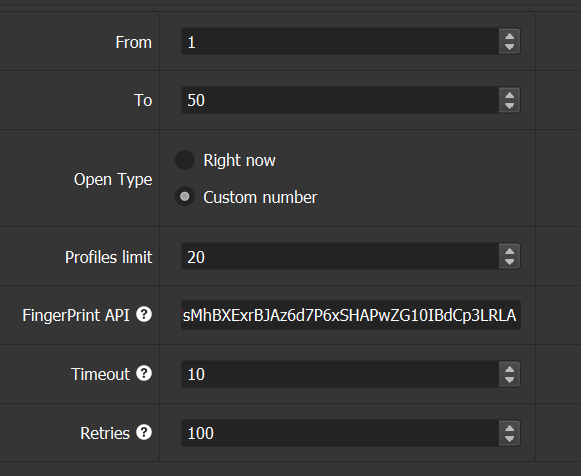

**Base of extantions for DAWN**

**Configuration upon launching `dawn_base.xml`:**

1. From\To - с какого по какой профиль создавать\запускать.
2. Open Type - открывать ли все профили, указанные в диапазоне, одномоментно либо ограничить максимально возможное количество одновременно открытых профилей (например, если система не тянет и вы хотите открывать только половину из диапазона).
   1. Profiles limit - ограничение по количеству одновременно поднятых профилей.
3. FingerPrint - ключ для получения отпечатков.
4. Timeout - сколько минут будет открыт один профиль.
5. Retries - сколько перезапусков будет делать софт после того, как пройдут все профили.

**Пример настройки №1**

При такой настройке софт будет обрабатывать 50 профилей, одновременно поднимая не больше 20 профилей, каждый профиль будет поднят не больше 10 минут. После того как будут отработаны все профили, такой круг повторится 100 раз.

**Пример настройки №2**

При такой настройке будут подняты все 25 профилей сразу, и они будут подняты, пока вы не отключите софт. Главное, чтобы перед переключением Profiles limit был больше, чем количество профилей в диапазоне.

При регистрации аккаунтов в профилях используйте настройку №2 с нужным для вас диапазоном, чтобы добавить новые профили. Софт сам увидит, что там нет входа, и передаст управление вам для регистрации. После того как вы зарегистрируетесь, нужно передать управление софту, и он завершит регистрацию в соцсетях, чтобы получить 15k поинтов. Видео-гайд ниже.

[Видео-гайд](example.mp4)

---

1. From\To - specifies the range of profiles to create\launch.
2. Open Type - whether to open all profiles within the specified range simultaneously or limit the maximum number of profiles opened at the same time (for example, if the system can't handle it and you want to open only half of the range).
   1. Profiles limit - the maximum number of profiles that can be active at once.
3. FingerPrint - the key for obtaining fingerprints.
4. Timeout - how many minutes one profile will remain open.
5. Retries - how many times the software will restart after all profiles have been processed.

**Configuration Example #1**

With this setup, the software will process 50 profiles, simultaneously launching no more than 20 profiles at a time, with each profile active for no more than 10 minutes. Once all profiles have been processed, this cycle will repeat 100 times.

**Configuration Example #2**

With this setup, all 25 profiles will be launched simultaneously and will remain active until you manually stop the software. The key point is that before switching, the Profiles limit should be higher than the number of profiles in the range.

When registering accounts in profiles, use Configuration #2 with the desired range to add new profiles. The software will automatically detect if a login is missing and will prompt you to register. After registration, you need to hand control back to the software, and it will complete the social media registration to obtain 15k points. A video guide is below.

[Video Guide](example.mp4)